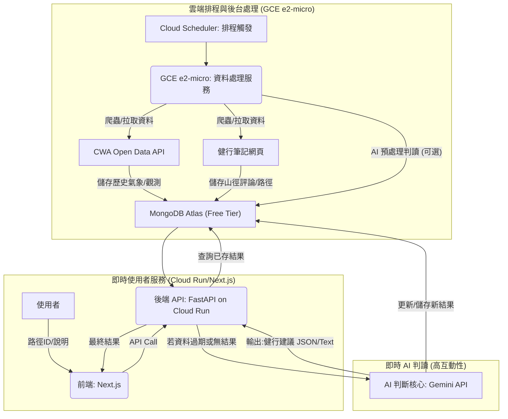

# hiking2023
hiking studio project of 2023 updated in 2025

# 快樂登山家 | Hiking Weather Guide MVP


[](https://example.com/link-to-competition)
## 📜 專案簡介 (Project Overview)

**「快樂登山家」**是一個以 **AI 驅動**的安全指南服務。此專案榮獲 **2023 年資料創新應用競賽第二名 (銀獎)** 的肯定。

我們的核心目標是：**減少初級登山者因不熟悉山徑、資訊缺乏所導致的潛在危險。**

本系統透過整合即時氣象、歷史路況、與 AI 判讀核心，為使用者提供精準、結構化且易懂的**路徑安全評分**與**健行建議**。

## ⚙️ 系統整體架構 (System Architecture)

本專案採用微服務 (Microservices) 混合架構，將數據擷取與預處理任務分派給後台，以確保前端服務的高效能和低延遲。

### 1. 架構圖 (Mermaid Diagram)



### 2\. 架構說明

  * **後台資料服務 (GCE):** 負責排程、執行網頁爬蟲 (`C2: 健行筆記`) 與官方 API 介接 (`C1: CWA Open Data`)，將非即時數據預先擷取並儲存於 **MongoDB (D)**，減輕即時 API 服務的負擔。
  * **即時 API 服務 (FastAPI on Cloud Run):** 這是使用者請求的主要入口。它首先查詢資料庫 (D)，若有現成且未過期的安全結果，則直接回傳。
  * **AI 判斷核心 (Gemini API):** 當資料庫中缺乏或結果過期時，**FastAPI (B)** 會即時呼叫 **Gemini API (E)** 進行綜合判斷，確保建議的時效性與準確性。

## 🛠️ 核心技術棧 (Tech Stack)

| 組件 | 技術選擇 | 關鍵優勢 |
| :--- | :--- | :--- |
| **後端框架** | **Python / FastAPI** | 依託 FastAPI 的高並發處理能力，確保 API 服務的快速響應。 |
| **AI 判讀** | **Google Gemini API** | 執行多源數據的複雜分析和結構化結果輸出。 |
| **資料庫** | **MongoDB Atlas** | 彈性儲存非結構化的路徑評論和預處理結果。 |
| **環境管理** | **uv (Rust-based)** | 採用 `uv` 實現 **10x+** 於傳統工具的依賴安裝速度和環境可重現性。 |
| **程式碼品質** | **Ruff (Rust-based)** | 用於 `pre-commit` 鉤子，以極致的速度完成格式化、Import 排序與 Linting。 |

## 🧗 步道資料管理與爬蟲

本系統包含一套完整的步道資料爬取、儲存與查詢機制。

### API Endpoints

-   **`GET /api/trails/{trail_id}`**
    -   **功能**: 從 MongoDB 中查詢指定 ID 的步道資料。
    -   **回傳**: `TrailDocument` 模型結構的 JSON 資料。

-   **`POST /api/trails/scrape/{trail_id}`**
    -   **功能**: 觸發一個**背景任務**，爬取並更新指定 ID 的步道資料。
    -   **回傳**: `202 Accepted`，表示任務已開始。

-   **`POST /api/trails/scrape-range`**
    -   **功能**: 觸發一個**背景任務**，爬取並更新一個 ID 範圍內的所有步道資料。
    -   **參數**: `start_id` (int), `end_id` (int)。
    -   **回傳**: `202 Accepted`，表示任務已開始。

### 排程爬蟲腳本 (`scraper_cron_job.py`)

此腳本專為部署在 GCE VM 上並由 `cron` 定期觸發而設計，支援**全量**與**增量**兩種更新模式。

-   **功能**:
    -   **增量更新 (Incremental Update)**：推薦用於每週執行的常規任務。
        1.  **探測新步道**：從目前資料庫中最大的 ID 向上探測，以發現新的步道資料。
        2.  **更新舊評論**：遍歷所有已存在的步道，並只為它們增量添加新的評論。
    -   **全量更新 (Full Scan)**：用於初始化資料庫或需要完整重建資料的場景。

-   **使用方式**:
    ```bash
    # 執行增量更新 (推薦)
    python scraper_cron_job.py --mode incremental --probe-limit 100

    # 執行全量掃描
    python scraper_cron_job.py --mode full --start-id 1 --end-id 2300
    ```

-   **建議 Crontab 設定 (增量更新)**:
    ```cron
    # 每週日凌晨 3 點執行增量更新
    0 3 * * 0 /usr/bin/python /path/to/project/scraper_cron_job.py --mode incremental >> /var/log/scraper.log 2>&1
    ```

## 🔮 未來展望與改進方向 (Future Work)

1.  **CI/CD 自動化部署**:
    -   我們已經設計了一套基於 **GitHub Actions** 和 **Cloudflare Tunnel** 的安全 CI/CD 流程 (`.github/workflows/deploy.yml`)。待 DNS 指向 Cloudflare 後，即可完成相關設定，實現 `main` 分支的自動化部署，無需手動登入伺服器。

2.  **爬蟲健壯性強化**:
    -   **代理與 User-Agent 輪換**: 若未來目標網站加入更嚴格的反爬蟲機制，可引入代理伺服器池 (Proxy Pool) 和 User-Agent 輪換，以降低被封鎖的風險。
    -   **錯誤重試機制**: 可為網路請求加入更完善的重試邏輯 (例如使用 `tenacity` 函式庫)，以應對暫時性的網路問題。

3.  **資料一致性與監控**:
    -   **資料驗證**: 在資料存入資料庫前，加入更嚴格的 Pydantic 驗證，確保所有欄位的格式和類型都符合預期。
    -   **監控與警報**: 可建立一個簡單的儀表板或發送通知 (例如到 Slack)，監控每次排程爬蟲的執行狀況 (成功、失敗、新增數量)，以便及時發現問題。

## 🚀 本地開發與運行 (Local Development)

### 1\. 環境初始化 (使用 `uv`)

本專案採用 `uv` 進行虛擬環境管理與套件安裝。

```bash
# 確保已安裝 uv，並在專案根目錄下執行
uv sync

# 激活虛擬環境 (Linux/WSL2)
source .venv/bin/activate
```

### 2\. 環境變數設定

本專案使用 Pydantic Settings 載入配置。請在專案根目錄創建 `.env` 檔案並填入必要的金鑰：

```ini
# .env (此檔案已設置於 .gitignore 中)
GEMINI_API_KEY="YOUR_GEMINI_API_KEY"
CWA_API_KEY="YOUR_CWA_API_KEY"
MONGO_URI="YOUR_MONGODB_CONNECTION_STRING"
```

### 3\. 啟動服務

使用 `uv run` 確保服務在正確的虛擬環境中啟動：

```bash
uv run uvicorn main:app --reload
```

### 4\. 程式碼品質檢查 (Pre-commit)

我們使用 `pre-commit` 結合 **Ruff** 實現最快的程式碼檢查。

```bash
# 安裝 pre-commit 依賴
uv pip install pre-commit

# 安裝 Git hooks (包含 pre-commit 和 pre-push)
pre-commit install -t pre-commit -t pre-push
```

此後，每次 `git commit` 將自動執行 `Ruff Format` 和 `Ruff Linting`。

```
```
domain name: hikingweatherguide.com
IP: cloudflare access tunnel + gce + domain name 不使用固定IP
